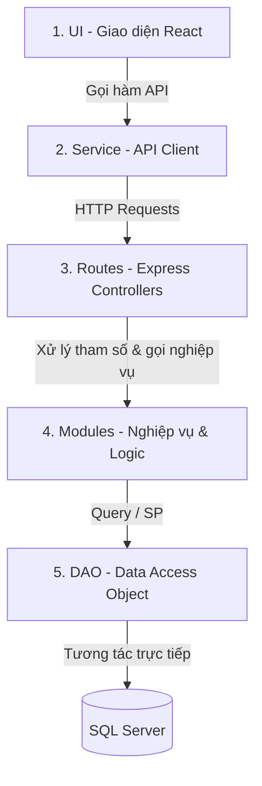

# Bản Đồ Kiến Trúc Phân Lớp N-Tier (newShopWeb)

Tài liệu này ánh xạ toàn bộ cấu trúc tệp tin của dự án theo luồng xử lý:
**UI ➔ Service ➔ Routes ➔ Modules (Service) ➔ DAO**

---

## 1. Sơ Đồ Luồng Dữ Liệu (Data Flow)

---

## 2. Danh Sách Chi Tiết Theo Các Lớp

### 2.1. Lớp UI (Giao diện người dùng - React.js)
Tọa lạc tại thư mục: [frontend/src/pages/](./newShopWeb/frontend/src/pages)

#### Phân hệ Auth (Đăng nhập / Đăng ký)
- [AdminLogin.jsx](./newShopWeb/frontend/src/pages/auth/AdminLogin/AdminLogin.jsx): Trang đăng nhập dành cho Quản trị viên/Nhân viên.
- [CustomerLogin.jsx](./newShopWeb/frontend/src/pages/auth/CustomerLogin/CustomerLogin.jsx): Trang đăng nhập/Đăng ký dành cho Khách hàng.

#### Phân hệ Customer (Khách hàng)
- [HomePage.jsx](./newShopWeb/frontend/src/pages/customer/HomePage/HomePage.jsx): Trang chủ hiển thị danh sách sản phẩm.
- [CategoriesPage.jsx](./newShopWeb/frontend/src/pages/customer/CategoriesPage/CategoriesPage.jsx): Trang hiển thị sản phẩm phân loại theo danh mục.
- [ProductDetailPage.jsx](./newShopWeb/frontend/src/pages/customer/ProductDetailPage/ProductDetailPage.jsx): Xem chi tiết thông số kỹ thuật của từng sản phẩm.
- [CheckoutPage.jsx](./newShopWeb/frontend/src/pages/customer/CheckoutPage/CheckoutPage.jsx): Giỏ hàng và tiến hành thanh toán (đồng bộ tự động địa chỉ/SĐT).
- [ProfilePage.jsx](./newShopWeb/frontend/src/pages/customer/ProfilePage/ProfilePage.jsx): Quản lý hồ sơ và cập nhật thông tin cá nhân.
- [PurchaseHistoryPage.jsx](./newShopWeb/frontend/src/pages/customer/PurchaseHistoryPage/PurchaseHistoryPage.jsx): Xem lịch sử mua hàng, chi tiết đơn hàng và trạng thái vận chuyển.
- [WarrantySearch.jsx](./newShopWeb/frontend/src/pages/customer/WarrantySearch/WarrantySearch.jsx): Tra cứu thông tin bảo hành của thiết bị qua số Serial.

#### Phân hệ Admin / Staff (Quản lý)
- [AdminDashboard.jsx](./newShopWeb/frontend/src/pages/admin/AdminDashboard/AdminDashboard.jsx): Trang tổng quan (KPIs, doanh thu, hàng tồn kho sắp hết).
- [ProductManagementPage.jsx](./newShopWeb/frontend/src/pages/admin/ProductManagementPage/ProductManagementPage.jsx): Quản lý danh sách sản phẩm.
- [OrderManagementPage.jsx](./newShopWeb/frontend/src/pages/admin/OrderManagementPage/OrderManagementPage.jsx): Duyệt đơn hàng và xuất kho cho đơn hàng.
- [InventoryManagementPage.jsx](./newShopWeb/frontend/src/pages/admin/InventoryManagementPage/InventoryManagementPage.jsx): Lập phiếu nhập kho, phiếu xuất kho, nhập số Serial của thiết bị.
- [SupplierManagementPage.jsx](./newShopWeb/frontend/src/pages/admin/SupplierManagementPage/SupplierManagementPage.jsx): Quản lý danh sách nhà cung cấp.
- [StaffManagementPage.jsx](./newShopWeb/frontend/src/pages/admin/StaffManagementPage/StaffManagementPage.jsx): Quản lý nhân sự, phân quyền tài khoản.
- [ActivityLogPage.jsx](./newShopWeb/frontend/src/pages/admin/ActivityLogPage/ActivityLogPage.jsx): Xem nhật ký hệ thống (System Logs).
- [DeviceHistory.jsx](./newShopWeb/frontend/src/pages/admin/DeviceHistory/DeviceHistory.jsx): Truy vết lịch sử nhập/xuất/bán của thiết bị qua số Serial.
- [WarrantyManagement.jsx](./newShopWeb/frontend/src/pages/admin/WarrantyManagement/WarrantyManagement.jsx): Quản lý phiếu bảo hành và lịch sử sửa chữa.

---

### 2.2. Lớp Service (API Client - Bridge)
Tọa lạc tại: [frontend/src/services/](./newShopWeb/frontend/src/services)
- [apiService.js](./newShopWeb/frontend/src/services/apiService.js): Đóng gói toàn bộ các hàm gọi API (sử dụng Axios) từ Client gửi lên Backend.

---

### 2.3. Lớp Routes (Express Routing / Controllers)
Tọa lạc tại: [backend/routes/](./newShopWeb/backend/routes)
- [auth.js](./newShopWeb/backend/routes/auth.js): Đăng nhập, đăng ký và xác thực tài khoản.
- [categories.js](./newShopWeb/backend/routes/categories.js): Router quản lý danh mục.
- [products.js](./newShopWeb/backend/routes/products.js): Router quản lý sản phẩm của Admin.
- [customerProducts.js](./newShopWeb/backend/routes/customerProducts.js): Router xem/lọc sản phẩm của Khách hàng.
- [orders.js](./newShopWeb/backend/routes/orders.js): Router duyệt đơn hàng, xuất kho cho Admin.
- [customerOrders.js](./newShopWeb/backend/routes/customerOrders.js): Router đặt hàng của Khách hàng.
- [customers.js](./newShopWeb/backend/routes/customers.js): Router hồ sơ khách hàng.
- [inventory.js](./newShopWeb/backend/routes/inventory.js): Router phiếu nhập/xuất và quản lý số Serial.
- [suppliers.js](./newShopWeb/backend/routes/suppliers.js): Router quản lý nhà cung cấp.
- [staff.js](./newShopWeb/backend/routes/staff.js): Router quản lý nhân viên của Admin.
- [logs.js](./newShopWeb/backend/routes/logs.js): Router xem lịch sử hệ thống.
- [analytics.js](./newShopWeb/backend/routes/analytics.js): Router xem báo cáo doanh số, KPIs.

---

### 2.4. Lớp Modules (Nghiệp vụ - Business Logic)
Tọa lạc tại: [backend/modules/](./newShopWeb/backend/modules)
- [AuthModule.js](./newShopWeb/backend/modules/AuthModule.js): Kiểm tra đăng nhập, phân quyền, đăng ký người dùng mới.
- [CategoryModule.js](./newShopWeb/backend/modules/CategoryModule.js): Validate thông tin danh mục.
- [ProductModule.js](./newShopWeb/backend/modules/ProductModule.js): Logic thêm/sửa sản phẩm, kiểm tra tệp hình ảnh.
- [OrderModule.js](./newShopWeb/backend/modules/OrderModule.js): Logic nghiệp vụ đơn hàng (kiểm tra tồn kho trước khi đặt, tự động đồng bộ địa chỉ/sđt vào tài khoản).
- [CustomerModule.js](./newShopWeb/backend/modules/CustomerModule.js): Validate thông tin cập nhật hồ sơ khách hàng.
- [InventoryModule.js](./newShopWeb/backend/modules/InventoryModule.js): Kiểm tra trùng lặp serial, kiểm tra định dạng phiếu nhập/xuất trước khi lưu.
- [SupplierModule.js](./newShopWeb/backend/modules/SupplierModule.js): Logic thêm/sửa nhà cung cấp.
- [StaffModule.js](./newShopWeb/backend/modules/StaffModule.js): Phân quyền nhân viên, cấp tài khoản mới.
- [LogModule.js](./newShopWeb/backend/modules/LogModule.js): Ghi/lọc nhật ký hoạt động.
- [AnalyticsModule.js](./newShopWeb/backend/modules/AnalyticsModule.js): Tính toán các chỉ số kinh doanh, tỷ lệ tăng trưởng.

---

### 2.5. Lớp DAO (Data Access Object - Truy xuất Database)
Tọa lạc tại: [backend/dao/](./newShopWeb/backend/dao)
- [AuthDAO.js](./newShopWeb/backend/dao/AuthDAO.js): Truy vấn User theo email, đăng ký tài khoản trong Database.
- [CategoryDAO.js](./newShopWeb/backend/dao/CategoryDAO.js): CRUD bảng Categories.
- [ProductDAO.js](./newShopWeb/backend/dao/ProductDAO.js): CRUD bảng Products, cập nhật tồn kho.
- [OrderDAO.js](./newShopWeb/backend/dao/OrderDAO.js): Gọi Stored Procedure `sp_AddNewOrder` (sử dụng Table-Valued Parameter), lấy lịch sử đơn hàng.
- [CustomerDAO.js](./newShopWeb/backend/dao/CustomerDAO.js): Đọc/ghi thông tin Users có vai trò là Khách hàng.
- [InventoryDAO.js](./newShopWeb/backend/dao/InventoryDAO.js): Lưu phiếu nhập/xuất và các bảng chi tiết phiếu nhập/xuất với Stored Procedure.
- [SupplierDAO.js](./newShopWeb/backend/dao/SupplierDAO.js): CRUD bảng Suppliers.
- [StaffDAO.js](./newShopWeb/backend/dao/StaffDAO.js): Đọc/ghi thông tin Users có vai trò là Nhân viên/Quản trị viên.
- [LogDAO.js](./newShopWeb/backend/dao/LogDAO.js): Lưu logs hoạt động của hệ thống vào Database.
- [AnalyticsDAO.js](./newShopWeb/backend/dao/AnalyticsDAO.js): Thực thi các câu SQL phân tích thống kê doanh số phức tạp.
